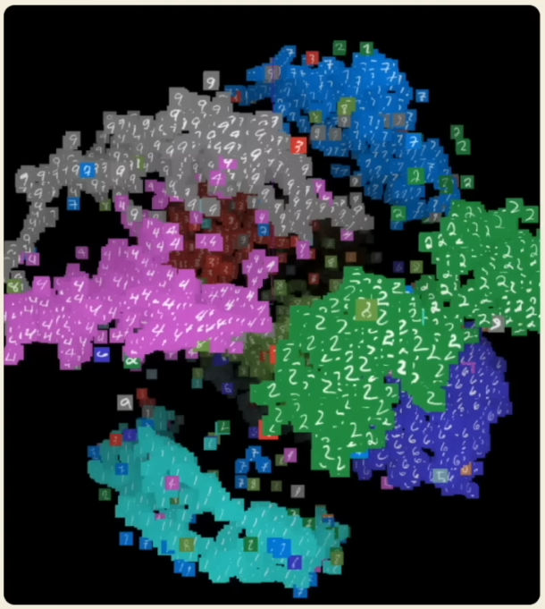
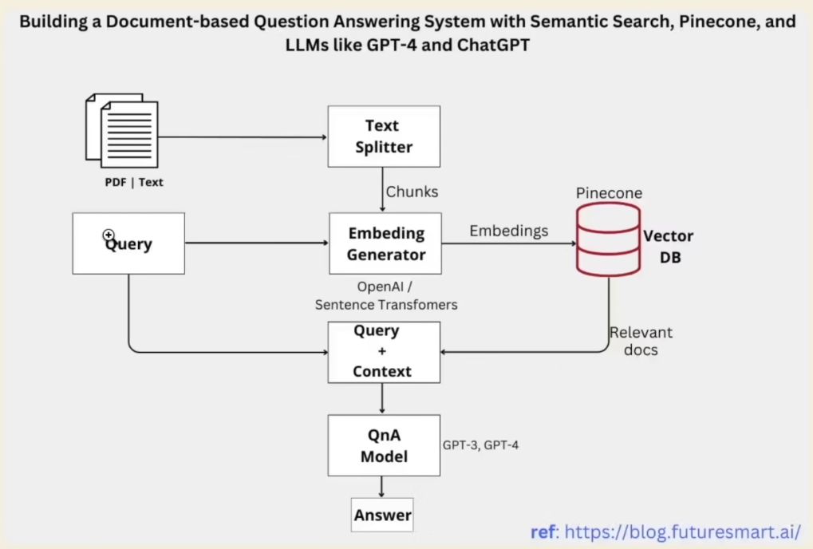

# Development with Large Language Model

## 1. Introduction to LLMs and Prompting

### 1.1. LLMs

**Modern LLMs:**

- GPT-3.5:
  - Transformer network.
  - Huge amounts of training data.
  - 175 billion parameters.
  - RLHF (Reinforcement Learning from Human Feedback).

- GPT-4:
  - Transformer network.
  - Even greater amount of training data.
  - 1.76 trillion parameters.
  - RLHF (Reinforcement Learning from Human Feedback).

**Training Problems:**

Next word/token prediction tasks:

- Question: The students opened their ... to the teacher's surprise. Answer: books.
- Question: `Luup.ai` is a great tool for building AI ... with no code. Answer: flow.
- Question: 1 + 1 = .... Answer: 2.
- Question: print.... Answer: ("hello world").

LLMs are trained to predict these tokens by giving it billions of sentences/chunks and answers. The data includes codes, college textbooks, articles, lyrics, podcasts, etc.

Multiple token prediction tasks $\rightarrow$ Put the output of your predicted token back into input and so on until the model outputs a stop sequence token.

**Fine-tuning** is the process of taking a pre-trained model and adapting it to a specific task. Nonetheless, fine-tuning can be expensive and not the best solution for custom knowledge updates due to **Catastrophic forgetting**. This phenomenon **occurs specifically when the network is trained sequentially on multiple tasks** because the **weights** in the network that are **important for task A** are **changed to meet the objectives of task B**

We'll be using `vector dbs` instead as it's a lot more effective for information retrieval and doesn't cause the model to `catastrophically forget`.

### 1.2. Prompting

**Prompting** is the process of inputting tokens into the model to allow it to generate and predict text that is likely to be correct, i.e. instructing an LLM like `gpt` with a question.

**Inference Parameters** include:

- `temperature`: How much randomness to add to the model's output? The higher the temperature, the more random the output.
- `top_p`: is another measure of randomness that accounts for how much the model should account for low probability words. It's recommended to use either `temperature` or `top_p` but not both.
- `frequency_penalty`: How much to penalise the model for repeated tokens?
- `presence_penalty`: is to penalise repeated tokens in general.

## 2. ChatGPT Playground

Go to [ChatGPT Playground](/src/openai_playground.ipynb).

[`tiktoken`](https://pypi.org/project/tiktoken/) is a tool that can help us count the number of tokens being used.

## 3. VectorDBs and Embeddings

**VectorDBs** are databases specifically for **storing embeddings**. Embeddings group similar objects or entities in a space.



Use cases of embeddings:

- Recommendation systems.
- Search Engines.
- Generative AI.
- Memory for LLMs.
- Context window expansion.
- Agents like AutoGPT.



Why should we use vector databases?

- Fast retrieval of the relevant context from embeddings.
- Convenient storage of embeddings.
- Context length augmentation.

Metadata helps us to store additional information about the embeddings. In the case that the model hallucinates, we can still look at the metadata and make our own decision.

```python
import chromadb


chroma_client = chromadb.Client()


collection = chroma_client.create_collection(name="my_collection")
collection.add(
    documents=[
        "this is a plumbing company",
        "we need a plumber asap",
        "kitchen sink has problems",
        "the living room is flooding",
        "bathroom needs cleaning immediately",
        "help! cleaner needed",
    ],
    metadatas=[
        {"source": "plumbing"},
        {"source": "plumbing"},
        {"source": "plumbing"},
        {"source": "plumbing"},
        {"source": "cleaning"},
        {"source": "cleaning"},
    ],
    ids=["id1", "id2", "id3", "id4", "id5", "id6"],
)
```

At the time of writing, `chromadb` will automatically loads `all-MiniLM-L6-v2` model from `huggingface` if it's not found in the local cache. This model is a `sentence-transformers`'s [pre-trained model](https://www.sbert.net/docs/pretrained_models.html).
